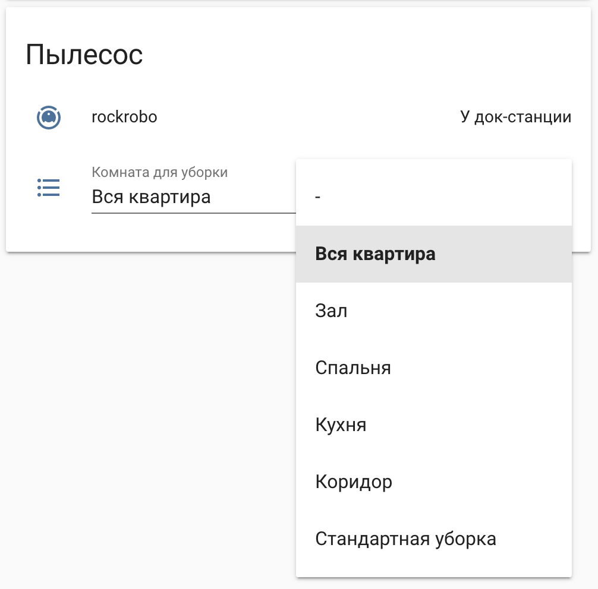
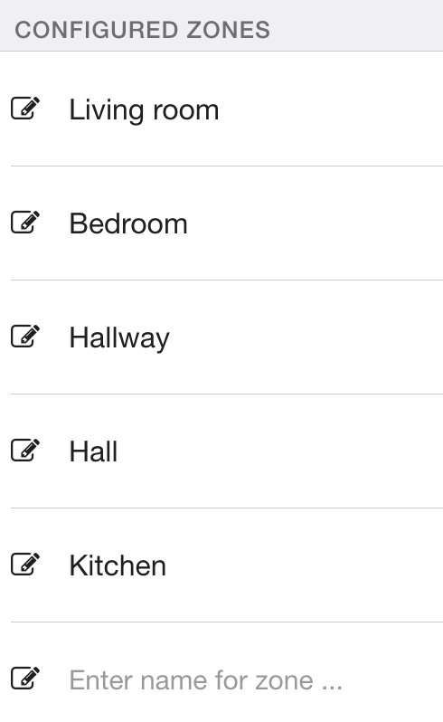

# Конфигурация Home Assistant

## Сервер

**H/W:** Ноутбук HP 620 - 8Gb RAM - 64Gb SSD - 320Gb HDD

**OS:** Ubuntu 19.04

## Устройства

1. Xiaomi Roborock S50 - [Valetudo](https://github.com/Hypfer/Valetudo) - MQTT

    Зональная уборка реализована с использованием именнованных зон, заданных в Valetudo

    

      
      
      
    

## Плагины Hass.io

1. [Mosquitto broker](https://home-assistant.io/addons/mosquitto)

1. [Visual Studio Code](https://github.com/hassio-addons/addon-vscode)
